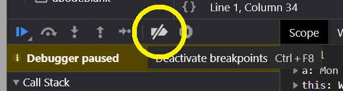
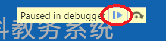
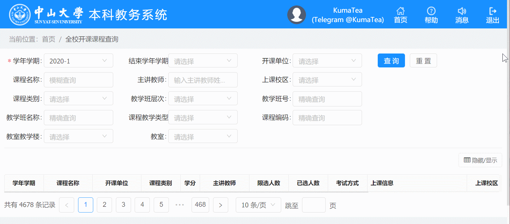

# SYSU-Student-Evaluation
中山大学教务系统学生自动评教脚本

## 更新
### 2020

一年过去，今年教务系统有两项升级：

* JavaScript 脚本中大量加入 `debugger` 语句，阻止控制台的使用
* 评分由按钮更改为输入框，常规状态下必须使用键盘输入

因此，针对这两项改动升级了脚本，以及更改了使用步骤，增加了更方便的方案。

### 2019

* 2019秋季学期新版教务评教系统，出现了区分大小写的验证码，出现概率为首次100%及随后约20%。
* 本次更新加入了检测验证码的机制。
  * Console出现红字POST无需惊慌

---

## 如何使用

由于今年教务系统加入了阻止使用控制台的措施，以下分为两种方式。

### 油猴脚本（推荐）

使用[油猴](https://en.wikipedia.org/wiki/Tampermonkey)脚本可以避免开启控制台。

确保你已经安装了对应[插件](https://chrome.google.com/webstore/detail/tampermonkey/dhdgffkkebhmkfjojejmpbldmpobfkfo)。

1. 安装这个脚本：[**中大自动评教**](https://greasyfork.org/zh-CN/scripts/417056-%E4%B8%AD%E5%A4%A7%E8%87%AA%E5%8A%A8%E8%AF%84%E6%95%99)
2. [登录教务系统](https://jwxt.sysu.edu.cn)后，打开[评教页面](https://jwxt.sysu.edu.cn/jwxt/mk/evaluation/#/evaluation)
3. 等待自动评教完成

### 控制台

1. [登录教务系统](https://jwxt.sysu.edu.cn/)后，打开[评教页面](https://jwxt.sysu.edu.cn/jwxt/mk/evaluation/#/evaluation)
2. 打开 [AutoEval.js](./AutoEval.js)，全选复制。也可选择 [精简版本](https://raw.githubusercontent.com/KumaTea/SYSU-Student-Evaluation/master/AutoEval.min.js)
3. 切换到[评教页面](https://jwxt.sysu.edu.cn/jwxt/mk/evaluation/#/evaluation)，按F12打开控制台 `Console`
4. 此时画面变灰。点击「禁用所有断点」  （点击查看大图），再点击继续  ，直至画面恢复正常。可以参考下方动图
4. 切换到控制台 `Console` 选项卡，粘贴代码，回车执行
5. 等待自动评教完成

## FAQ

* 推荐使用 `Chromium` 内核浏览器，如
  * [Chrome](https://www.google.com/chrome)
  * [**新版** Microsoft Edge](https://www.microsoft.com/en-us/edge)
* 如果运行出错，请更新浏览器版本
* 默认为满分。可以调节 `good_rate` 参数，评分依据该参数乘以总分，四舍五入得出

## 鸣谢
* [双鸭山电报频道](https://t.me/cshs_edu_pill)的[这个脚本](https://t.me/cshs_edu_pill/273)
* [React](https://reactjs.org) 项目的[这个 issue](https://github.com/facebook/react/issues/11488) 中[**这条回复**](https://github.com/facebook/react/issues/11488#issuecomment-347775628)

## 免责声明
* 本脚本虽然经过测试，但无法保证适用所有情况，且作者不承担因程序出错产生的任何后果。

## 后记
* 感谢所有老师的辛勤付出
* 感谢教务系统的升级让我学到了更多 Web 编程知识
